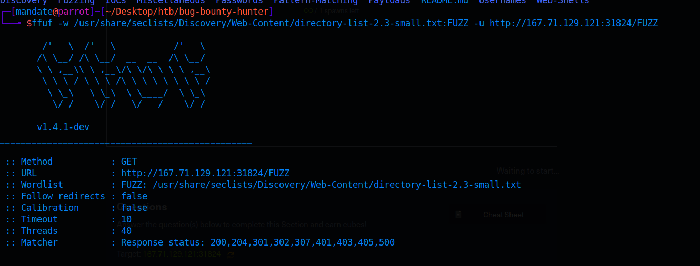

# Introduction and Web Fuzzing

This section will go over fuzzing for directories and files, hidden vhosts, PHP parameters, and parameter values, with the ffuf tool.

Fuzzing refers to sending various types of user input to some interface, to observe how it reacts. This can include various get requests with special parameters, or trying to perform a SQL injection.

# Basic Fuzzing

## Directory Fuzzing

ffuf -w /opt/useful/seclists/Discovery/Web-Content/directory-list-2.3-small.txt:FUZZ -u website.com:80/FUZZ

Here, we assign the FUZZ keyword to the end of the wordlist, and this indictates the content of what will be sent (so in this case, it'll use that wordlist as input), and we specify on where this input goes by typing FUZZ at the end of the url (so in this case, it will fuzz for directories).

//Author's note: I use diresearch for directory fuzzing, but it's preference



## Extension Fuzzing

```ffuf -w /usr/share/seclists/Discovery/Web-Content/web-extensions.txt:FUZZ -u http://SERVER_IP:PORT/blog/indexFUZZ```

Notice how we add the FUZZ to the end of index. This helps us find extensions. This wordlist has a "." before the extensions, so we don't need to represent that in the URL.

## Page Fuzzing

```ffuf -w /usr/share/seclists/Discovery/Web-Content/directory-list-2.3-small.txt:FUZZ -u http://SERVER_IP:PORT/blog/FUZZ.php```

We know the extension is .php, so we add the FUZZ before the .php, where we'd expect the name of the page to be.

## Recursive Fuzzing

Usually in websites, there are directories with stuff below them. We can use recursive fuzzing to automatically enumerate these directories.

```ffuf -w /usr/share/seclists/Discovery/Web-Content/directory-list-2.3-small.txt:FUZZ -u http://SERVER_IP:PORT/FUZZ -recursion -recursion-depth 1 -e .php -v```

-e specifies extension .php (usually site wide), -recursion specifies recursive mode and -recursion-depth 1 specifies a depth of 1 (it'll discover 1 level of directories, and then look down in that 1 level.)

## DNS Records

```sudo sh -c 'echo "10.10.10.11  academy.htb" >> /etc/hosts'```

If we want to hardcode a DNS resolution, we can add it in /etc/hosts. This is relevant for when we want to look for subdomains.

## Sub Domains

Lie beneath a domain name, ie photos.google.com is in the photos subdomain of google.com

```ffuf -w /usr/share/seclists/Discovery/DNS/subdomains-top1million-5000.txt:FUZZ -u https://FUZZ.hackthebox.eu/```

## VHost Fuzzing

A Vhost is a sub domain  on the same IP. This can be used to find private subdomains for a website.

We can use ffuf to fuzz for vhosts and private sub domains with by using -H to add a Host: header.

```ffuf -w /usr/share/seclists/Discovery/DNS/subdomains-top1million-5000.txt:FUZZ -u http://academy.htb:PORT/ -H 'Host: FUZZ.academy.htb' -fs 100```

This will always result in 200 OK response, so we would differentiate (to see if something exists), by looking at the response size.

## Filtering Results with ffuf

ffuf automatically filters by result code, but as seen with vhost fuzzing, we might want different filters. This usage will filter out (ie remove) whatever matches the filter. So adding -fs 900 would filter out all results with a HTTP response size of 900. 

Note: since these are for subdomains, we need to add subdomains to /etc/hosts before we can access them.

## GET Parameter Fuzzing

Some parameters for a webpage might exist but be hidden, so fuzzing for them is useful.

```ffuf -w /usr/share/seclists/Discovery/Web-Content/burp-parameter-names.txt:FUZZ -u http://165.22.115.197:30041/admin.php?FUZZ=key -fs xxx```

This fuzzes for a GET parameter (which exists in the url). We run it for a little while, and then filter out the default response size.


