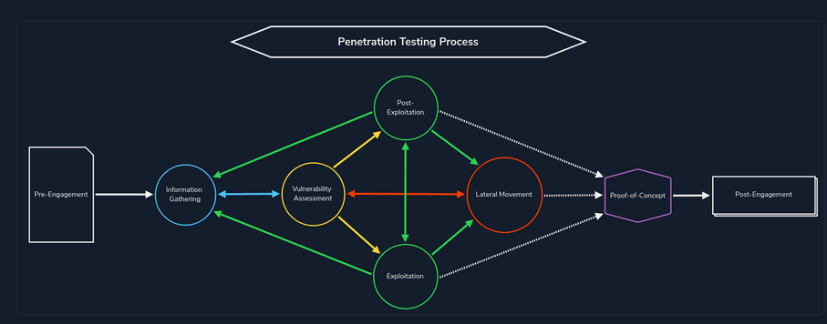
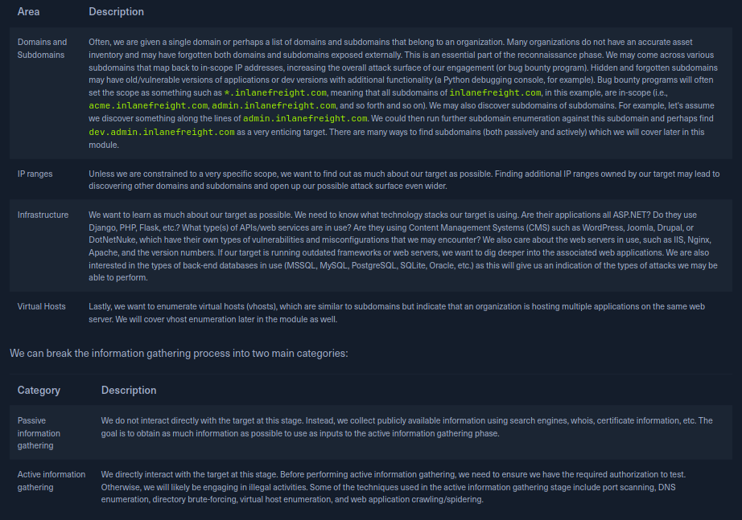

# Intro to Information Gathering

Gathering information is the first step in every red team engagement, where we needto enumerate things like attack surface.






Hackerone is a good web source for hunting bug bounties.

# WHOIS

Is a white pages for domain names. We can use it to lookup information about a domain.

```whois facebook.com```

## DNS

Is the fact of resolving domain names (google.com) to IPs with the proper data (19.24.2.4).

Different types of DNS records like 

A(maps domain name to IPV4)
AAAA(maps domain name to IPV6)
CNAME(maps domain name to domain name)

And so on.

dig is also a useful command

```dig google.com```

# Passive Subdomain Enumeration

Mapping subdomains via public information (like a DNS such as virustotal relations).

crt.sh and search.censys.io provide a way to find certificates for a subdomain, which must be publicly accessible.

theharvester is a good way to grab OSINT or public information about a target. It will query a public resource for information about a target.
```

cat sources.txt

baidu
bufferoverun
crtsh
hackertarget
otx
projecdiscovery
rapiddns
sublist3r
threatcrowd
trello
urlscan
vhost
virustotal
zoomeye

export TARGET="facebook.com"
cat sources.txt | while read source; do theHarvester -d "${TARGET}" -b $source -f "${source}_${TARGET}";done
```

# Passive Infrastructure Identification

Netcraft a good tool for offeirng us information about servers.

Wayback machine allows us to access previous versions of a website, which might have interesting content that wasn't removed in that version, such as a wp site that had a public wp-content directory.

# Active Infrastructure Identification

We can curl a website, and loo kfor the X-Powered-By to see what tech stack is helping power the website.

```whatweb -a3 domain.com -v``` will enumerate further information about a website's tech stack.

Wappalyzer is also useful.

wafw00f will test for a WAF firewall, and check for what filters are in place.

# Active Subdomain Emumeration

Zone transfers are used to set up DNS referalls, with a secondary DNS server being updated with information form a primary DNS server.

```
nslookup -type=NS zonetransfer.me
nslookup -type=any -query=AXFR zonetransfer.me nsztm1.digi.ninja
```

Skills Assessment

To find the FQDN of the ns for inlanefreight.htb
```nslookup -type=any inlanefreight.htb 10.129.58.5```

```nslookup -query=AXFR inlanefreight.htb 10.129.58.5```

To find the TXT record, query all of the given subdomains, until we find the correct one

```nslookup -query=TXT internal.inlanefreight.htb 10.129.101.151```

```
dig a inlanefreight.htb ns.inlanefreight.htb
```
